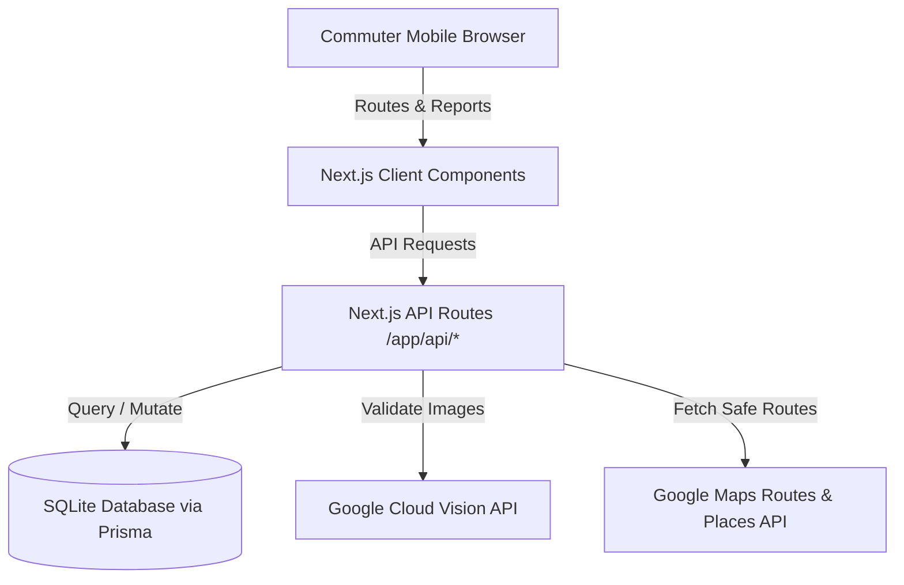

# Architecture Blueprint: Ligtas-Lakbay

## 1. Core Tech Stack
- **Framework:** Next.js (App Router, standard layout conventions).
- **Styling:** Vanilla CSS & CSS Modules (ensuring maximum styling control, fluid glassmorphic cards, and zero CSS framework bloat).
- **Database:** SQLite (local development file database for lightweight, self-contained MVP deployment).
- **ORM:** Prisma ORM for type-safe database queries and migrations.
- **Routing & Maps:** Google Maps JavaScript API (via `@react-google-maps/api`), Google Routes API, and Places API for autocomplete.
- **Image Processing:** Google Cloud Vision API Client (`@google-cloud/vision`) for automated verification of hazard report photos.

---

## 2. System Architecture
Ligtas-Lakbay uses a standard Next.js 3-tier architecture:

### Key Modules & Directories
- `/app`: Contains all pages, layout structures, and API route endpoints.
- `/components`: Small, reusable interface components (e.g., Map, HazardModal, ProfileSelector, ReportButton).
- `/lib`: Server-side libraries, client initializations (PrismaClient, Maps API loaders, Vision API clients).
- `/prisma`: Schema definition and migrations for the SQLite database.
- `/styles`: Global CSS variables, reset templates, and modular stylesheet files.

---

## 3. Databases & Data Storage
- **Primary Database:** SQLite (`dev.db`).
- **File Upload Storage:** Local file system upload directory `/public/uploads/` for development, transitioning to Google Cloud Storage for production.

---

## 4. Test Runners & Frameworks
- **E2E Testing:** Playwright (for automated browser testing and user interaction validation, especially route switches).
- **Unit & Integration Testing:** Jest & React Testing Library.

---

## 5. Code Formatting & Linting Configurations
- **Indentation:** 2 Spaces.
- **Formatting Tools:** Prettier and ESLint.
- **TypeScript Constraints:** Strict typing enabled. Avoid using the `any` keyword. All custom API handlers must have validated request payloads.

---

## 6. Architecture Audit (File Line Count Ledger)
*Note: This ledger will keep track of active application code to prevent file bloat.*

| File Name | Location | Line Count (Est.) | Purpose |
| :--- | :--- | :--- | :--- |
| `schema.prisma` | `/prisma/schema.prisma` | <50 | Database schema definitions |
| `globals.css` | `/styles/globals.css` | <100 | Design system CSS variables & glassmorphism utilities |
| `page.tsx` | `/app/page.tsx` | <100 | Main layout page aggregating Map and UI drawers |
| `route.ts` | `/app/api/reports/route.ts`| <80 | API for creating and querying crowdsourced hazard reports |
| `route.ts` | `/app/api/vision/route.ts` | <60 | API route handler interfacing with Google Cloud Vision |
| `Map.tsx` | `/components/Map.tsx` | <120 | React component wrapping the Google Maps Canvas |
| `ProfileSelector.tsx`| `/components/ProfileSelector.tsx` | <60 | Routing mode buttons (Accessibility, Student, Rain) |
| `HazardModal.tsx` | `/components/HazardModal.tsx` | <100 | Visual upload form with Cloud Vision verification status |
