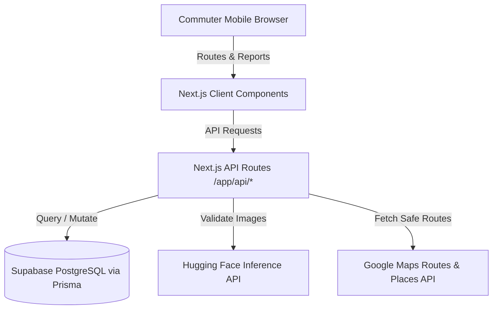
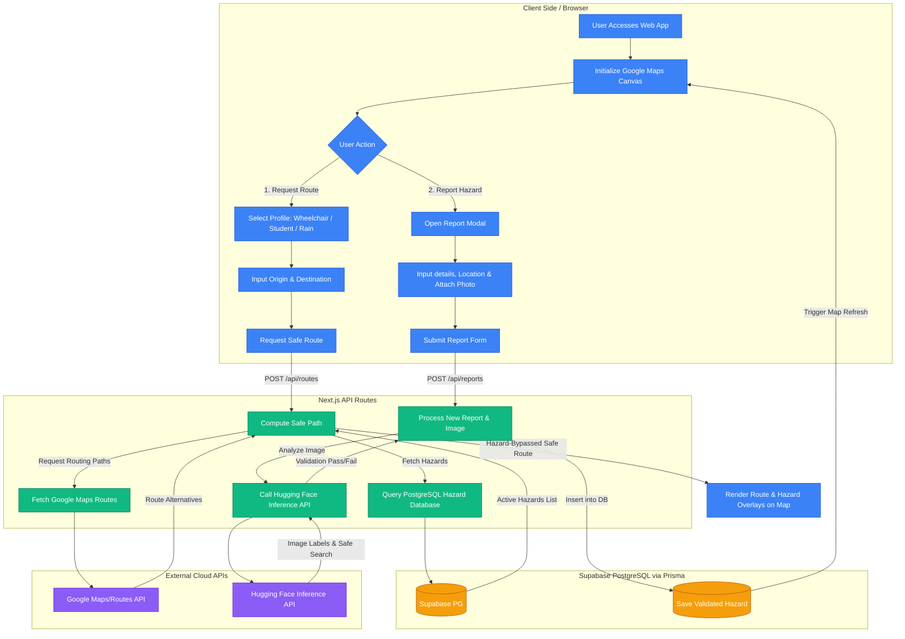

# Architecture Blueprint: Ligtas-Lakbay

## 1. Core Tech Stack
- **Framework:** Next.js (App Router, standard layout conventions).
- **Styling:** Vanilla CSS & CSS Modules (ensuring maximum styling control, fluid glassmorphic cards, and zero CSS framework bloat).
- **Database:** PostgreSQL (Supabase hosted relational database with transaction connection pooling for serverless execution).
- **ORM:** Prisma ORM for type-safe database queries and migrations.
- **Routing & Maps:** Google Maps JavaScript API (via `@react-google-maps/api`), Google Routes API, and Places API for autocomplete.
- **Image Processing:** Hugging Face Inference API (using hosted open-source vision models like ViT or CLIP) for automated verification of hazard report photos.

---

## 2. System Architecture
Ligtas-Lakbay employs a dedicated **Mobile-First Architecture** where the client-side environment is designed specifically to optimize rendering and interactions for mobile browsers:



### Key Modules & Directories
- `/app`: Contains all pages, layout structures, and API route endpoints.
- `/components`: Small, reusable interface components (e.g., Map, HazardModal, ProfileSelector, ReportButton).
- `/lib`: Server-side libraries, client initializations (PrismaClient, Maps API loaders, Hugging Face API helper).
- `/prisma`: Schema definition and migrations for the PostgreSQL/Supabase database.
- `/styles`: Global CSS variables, reset templates, and modular stylesheet files.

### 2.1 Web App Flow Diagram
Below is the comprehensive sequence flow mapping client interaction, backend route calculations, database queries, and external API verifications:



---

## 3. Workspace File Structure
Below is the current structure of the workspace, showing configuration files, metadata documentation, and local Next.js declarations:

```
C:\AI-Integrated-Coding\SPARKFEST
├── .agents/                    # Workspace agent configurations & rules
├── .env.local.example          # Environment variables template
├── .git/                       # Local Git repository
├── .gitignore                  # Git ignore definitions
├── .next/                      # Next.js build cache (development environment)
├── AGENTS.md                   # Customization rules and agent constraints
├── Architecture.md             # System architecture, schemas, and file ledgers (This file)
├── Build.md                    # Plan of execution and step-by-step milestones
├── Design.md                   # Visual guidelines, color theme, and UX specification
├── GEMINI.md                   # Core coding guidelines and operational rules
├── memorycontext.md            # Living context log of the development trajectory
├── next-env.d.ts               # Next.js TypeScript environment declarations
├── node_modules/               # Installed dependencies
├── PID.md                      # Project scope, MVP list, target audience definition
├── Progress.md                 # Ledger for tracking completed frontend & backend tasks
├── README.md                   # General workspace readme
└── Schema.md                   # Prisma PostgreSQL database schema definitions
```

---

## 4. Databases & Data Storage
- **Primary Database:** Supabase PostgreSQL (via pooling `DATABASE_URL` transaction endpoint and `DIRECT_URL` migration endpoint).
- **File Upload Storage:** Local file system upload directory `/public/uploads/` for development, transitioning to Google Cloud Storage or Supabase Storage for production.

---

## 5. Test Runners & Frameworks
- **E2E Testing:** Playwright (for automated browser testing and user interaction validation, especially route switches).
- **Unit & Integration Testing:** Jest & React Testing Library.

---

## 6. Code Formatting & Linting Configurations
- **Indentation:** 2 Spaces.
- **Formatting Tools:** Prettier and ESLint.
- **TypeScript Constraints:** Strict typing enabled. Avoid using the `any` keyword. All custom API handlers must have validated request payloads.

---

## 7. Architecture Audit (File Line Count Ledger)
*Note: This ledger will keep track of active application code to prevent file bloat.*

| File Name | Location | Line Count (Est.) | Purpose |
| :--- | :--- | :--- | :--- |
| `schema.prisma` | `/prisma/schema.prisma` | <50 | Database schema definitions |
| `globals.css` | `/styles/globals.css` | <100 | Design system CSS variables & glassmorphism utilities |
| `page.tsx` | `/app/page.tsx` | <100 | Main layout page aggregating Map and UI drawers |
| `route.ts` | `/app/api/reports/route.ts`| <80 | API for creating and querying crowdsourced hazard reports |
| `route.ts` | `/app/api/vision/route.ts` | <60 | API route handler interfacing with Hugging Face Inference API |
| `Map.tsx` | `/components/Map.tsx` | <120 | React component wrapping the Google Maps Canvas |
| `ProfileSelector.tsx`| `/components/ProfileSelector.tsx` | <60 | Routing mode buttons (Accessibility, Student, Rain) |
| `HazardModal.tsx` | `/components/HazardModal.tsx` | <100 | Visual upload form with Hugging Face verification status |
