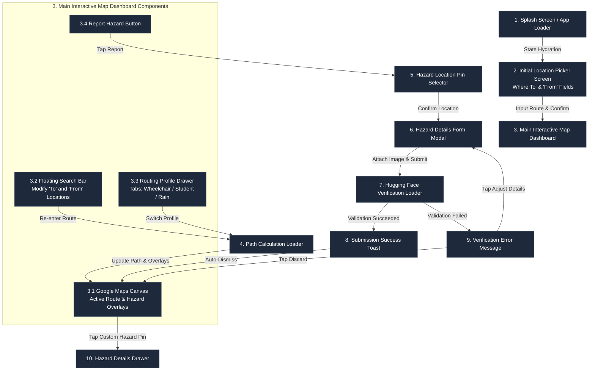

# Design Specification Document: Ligtas-Lakbay

## 1. Design Philosophy
- **Vibrant & Accessible (Inclusivity-First):** Ligtas-Lakbay uses a high-contrast, premium dark mode aesthetic combined with clear, color-blind-friendly highlight accents.
- **Mobile-First Architecture:** Designs are built for touch interaction, single-handed use, and portrait orientations first. Scaling to larger viewports is secondary; layouts are structured using responsive variables to maintain a mobile-native feel on all devices.
- **Glassmorphic Floating Panels:** Elements float above the map canvas using subtle backdrop blurs (`backdrop-filter: blur(12px)`) and semi-transparent borders to feel lightweight and modern.
- **Micro-Animations & Transitions:** Smooth translations (`ease-out`, `300ms`) for sliding routing panels, pulsing indicators for active hazards, and interactive scale highlights on profile selectors.
- **Visual Equality of Hazards:** Infrastructure issues (e.g., broken elevator) and environmental hazards (e.g., flooding) are represented with consistent severity indicators (Amber for warning, Red for blocked/severe).

---

## 2. Typography & Color Palette
### Color Palette
- **Primary Background:** Deep Charcoal (`#0B0F19`) with slightly lighter cards (`#161F30`).
- **Accent - Wheelchair/Accessibility:** High-visibility Cyan (`#00F0FF`).
- **Accent - Student/Shade Routing:** Radiant Amber/Orange (`#FF9F00`).
- **Accent - Rain/Flood Routing:** Neon Blue (`#3B82F6`).
- **Hazard Indicator - Medium Severity:** Vibrant Yellow (`#F59E0B`).
- **Hazard Indicator - High Severity:** Intense Coral Red (`#EF4444`).
- **Card Borders & Glassmorphism:** Semi-transparent white (`rgba(255, 255, 255, 0.08)`).

### Typography (Google Fonts)
- **Primary Font:** **Outfit** (clean, geometric, highly legible on mobile displays).
- **Scale Hierarchy:**
  - Header Title: `Outfit Bold` 24px
  - Sub-headers: `Outfit SemiBold` 18px
  - Body Text: `Outfit Regular` 14px
  - Micro-metadata/Tags: `Outfit Medium` 11px

---

## 3. Targeted Design & Planned Layouts
### Main View (Mobile Web Layout)
- **Map Container:** Full-screen dynamic map background (rendered via Google Maps API).
- **Floating Header Banner:** A search bar overlay containing location auto-complete and user profile controls.
- **Floating Bottom Navigation Bar:** Offers quick access to routing setup, hazard report trigger, and settings.
- **Interactive Routing Drawer:** Sliding sheet coming from the bottom with profile selection tabs:
  - `Wheelchair/Stroller` (Icon: Accessibility)
  - `Student Mode` (Icon: Umbrella/Shade)
  - `Rain Mode` (Icon: Droplet)

### Smart Hazard Reporting Dialog
- **Modal Panel:** Centered card with glassmorphism overlay.
- **Interactive Image Uploader:** A custom drag-and-drop file select target with image preview capability.
- **Hazard Details Fields:** Selection list for hazard type (Blocked Walkway, Flooding, Broken Elevator/Escalator, Street Obstruction) and simple text notes.
- **Submission Feedback:** Auto-analysis indicator showing Hugging Face Inference API processing status.

---

## 4. Interface Interactions & Behavioral Blueprints
### 1. Route Selection Workflow
- *Action:* User taps a routing profile button (e.g., Student Mode).
- *Feedback:* The active profile button transitions with a scale and color-fill animation. A custom request is made to the mapping backend.
- *Visual Update:* The map path redraws, displaying a color-coded route (e.g., Orange-tinted for shaded path, Cyan for flat ramp path) avoiding any active hazards matching the avoidance filters.

### 2. Hazard Report Submission & Verification
- *Action:* User snaps a photo and hits "Verify & Post".
- *Feedback:* A progress loader displays "Verifying image with Hugging Face API...".
- *Result:* Once validated, the modal closes with a slide-down animation, and a pulsing color-coded marker instantly spawns on the map.

---

## 5. Page & View Flow Diagram
Below is the transition flow illustrating how views, sheets, and modals load and route on the user's device, reflecting the entry route selection before landing on the main interactive map dashboard:

